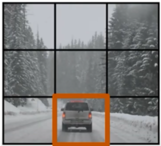
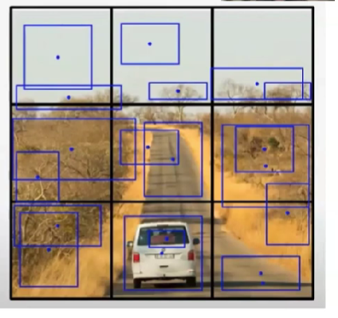
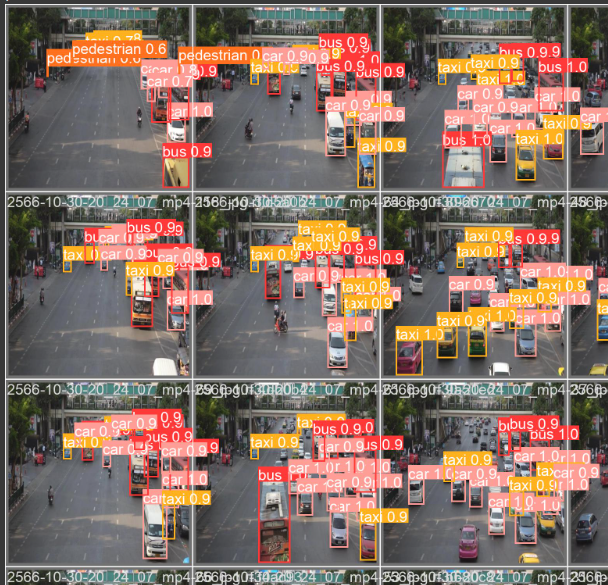
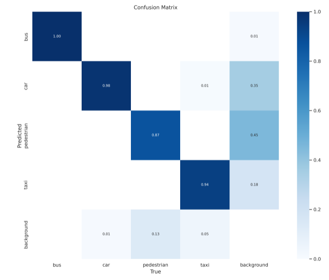

# Introduction
this project is about detecting criminal or abnormal behaviors.
which are useful by following reasons:
- evidence can be easily obtained even from many sources.
- can be used to notify near by police station (sometime it is hard for hostages to call polices).
- other kind of anomaly can be observed effectively
# Knowledges
In order to solve the problem, we need to receive images from the camera and then detect something out of it. and not only we need to focus on spatial elements we also need to focus on the temporal elements because in real world event is happen in sequence. 

To detect these behaviors, professor said that she use GAN model with supervise learning method to learn and highlight zone that have abnormal behaviors. and to did that easily we need object detection model and the popular one is YOLO (You Only Look Once) model which have many version which updated to optimize the performance.

## YOLO overview
they name this model "You Only Look Once" because this model get bounding box and classification result directly from raw images.
and the method of training is 
|first separate image to grid|then train to detect bounding box|
|----|----|
|||

**note that:** output size is n grid x n grid x (5 x bounding box/grid + number of class )

then it will do post processing to merge overlap bounding box and remove duplicate result by apply thredshold on confidence scores of each boxes.
### objective function 
- localization loss -> euclidian distance (MSE)
    - position, size 
    - bounding box
- classification loss (MSE of possibilities/ binary crosentropy)
- confidence loss (MSE)
# workshop
in this workshop I have Annotage 100 images from the video which can be access here: https://app.roboflow.com/ds/8iISTGAJ0P?key=9s7qZp3oqr
and here is result after training which have pretty decent performance.

# Application
for applying this model in real world we need to know our budget.
if we have high performance GPU we can centralize operation and use it as  single API gate way for many cameras.
but if there is bottleneck problem that effect the performance of model, we may need to consider doing load balancing by using cloud computing and separate section for camera to solve the problem.