# Introduction
this project involve working with bio-signal which simply signal receive from organic creature such as electric signal from brain or heartbeat

and we will use deep learning to determine sleep state scoring in this project.
we doing sleep state scoring for several reason such as
- insomnia
- sleep apnea

in this kind of problem it is require patients to tell the observed symptoms so far to find the cause. the data received from the patient often not enough to identify the cause and right treatment method. So they need to record the bio- signal from their brain for whole night.Also each hospital has limited number of bed So,there are bottleneck in the process. So we make system that make this process easier and does not require sleeping at hospital using deep learning so It can extract significant information on its own.

# Bio-signal technique
preprocessing have to be done in order to remove noises from the data.

Feature extraction is require domain expert to able to analyze the relation of all feature which we call this process **"hands-engineering"**  and this process is application specific.

and these two process need deep understanding of the domain we working with.In order to eliminate the need of these two process we can use deep learning technique instead.

# case study project (sleep state scoring)
- target: sleep efficiency
- how: collect Polysomnogram (PSG) (8hours of sleep for severals days)
    - EEG : brain wave
    - EOG : pupils signal
    - ECG : heart signal
    - EMG : muscle signal

in 8 hours of sleep we will sample every 30 seconds and label the state of sleeping that have 5 types consisting of:
- non rapid eye movement
    - N1 : sleep on set
    - N2 : light sleep
    - N3 : deep sleep
- REM : Rapid Eye movement (Dreaming)
- W : awake

Normally ,It cycles between non REM and REM stage for several time with increasing longer and deeper REM toward awake time.
## example domain knowledge approach
and here is example of sleeping evaluation by using domain knowledge

**N2 stage** : eye and brain work at the same time for short period
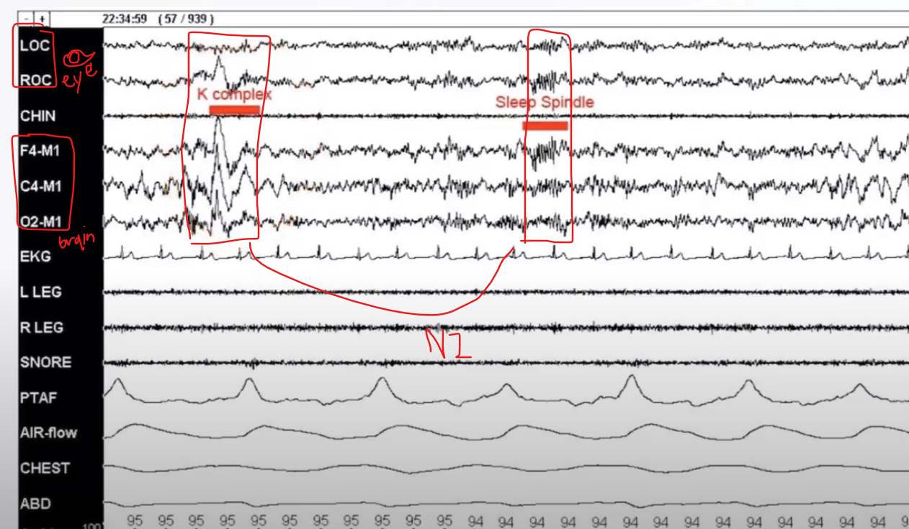

**REM stage** : stable brain wave but chaotic eye movement
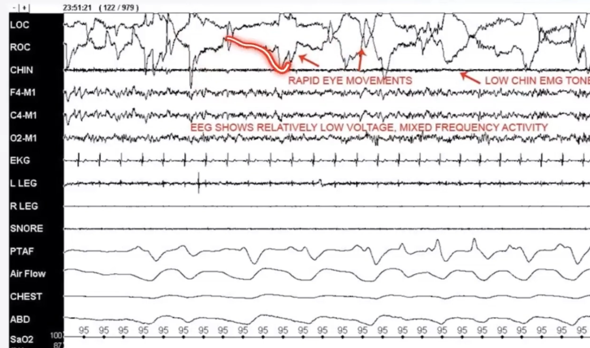

## criteria use for scoring
- Total sleep time (TST)
- Time in bed (TIB)
- etc...

here is the calculation : $Sleep Efficiency = \frac{TST}{TIB}*100$ 

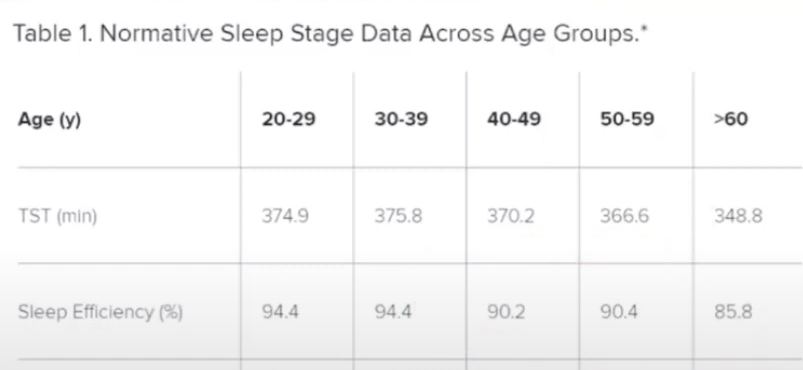
as you can see, this is very time consuming for evaluating single patient so I would be nice to be able to do this at home. But, there are too many signals to collect and it is not portable. So we need to reduce the number of signals. to make it more easy to set up by using single channel EEG.

# Modeling 
Dataset we use can be access [here](https://physionet.org/content/sleep-edfx/1.0.0/) 
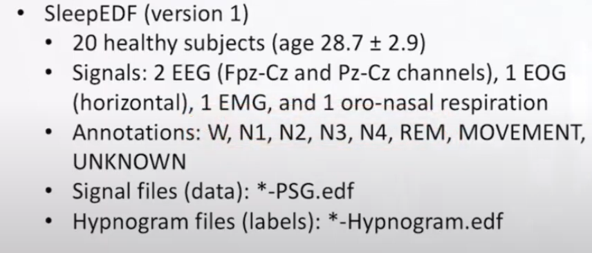
- PSG file store signal data
- Hypnogram files store labels

The model we study today is Deep Sleep Net (2017) -> (optimize) Tiny Sleep Net (2020)
### deep sleep net architecture
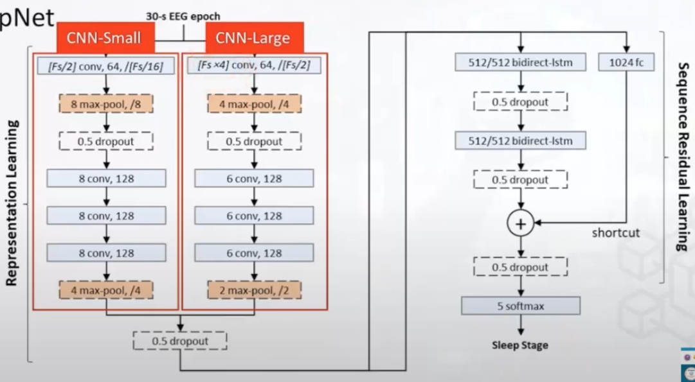
in Representation learning there is two part which is inspire by the concept of fourier transform that observe behavior in different size of filter to capture characteristic of signal in different length of signal. which 1D-CNN will slide and try to learn received pattern by iteratively dot product and tune parameter by get loss value and re calculate filter value.

in Sequence Residual learning, Bidirectional LSTM is utilized to learn state transition of detected pattern from the CNN layers and there is short cut connection  which inspire from RESNet architecture that make model able to converge easier by giving model a choice of utilize given data.

**Note** the standard optimizer is Adam. and there is no significant improvement by using other kind of optimizer. however the out come mostly great if you use the optimizer that you have mastered because you have ability to manipulate it at will.
### Tiny Sleep net 
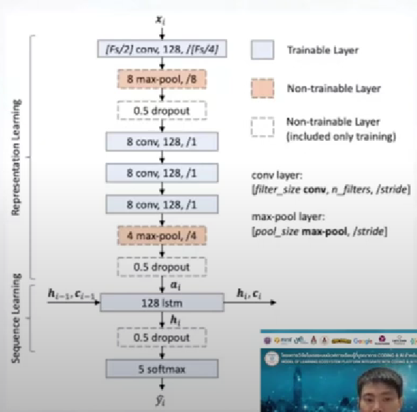

this is small version of previous architecture with these modification.

architecture parts
- use only 1 branch of 1D- CNN layer but increase number of filters to decrease number of node and retain the same characteristic and also make this layer easier to tune the parameters by merge all layers necessary together.
- reduce layer and size of filter sequential learning part
- change from Bidirectional LSTM to normal one ( may be this kind of signal only needed to observe in one direction)

training part
- doing data augmentation
    - random shift signal
    - sequence augmentation -> random skipping state at start of training
    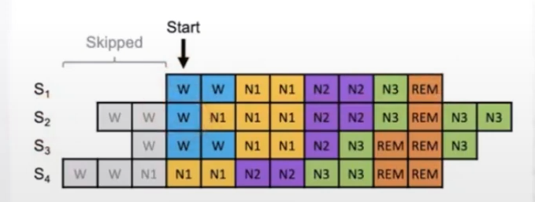

- use custom weighted cross-entropy loss function to solve data in-balance problem that make model underfit on class N1 which is important stage to identify sleep problem. and we do that by give extra loss when it classify class N1 wrong
- not utilize transfer learning

# Evaluation
this section will  pro vide only meaningful information
## Experiment settings
 k-fold cross validation

 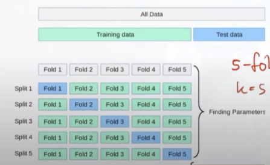
 1. split training data into k fold
 2. select i fold for validation
 3. use the rest for training

 and by doing this we can still save testing set for real testing instead using it for validation set.So in this case we do 20 fold for each number of person.
## Performance
- Overall
    - acc, F1
    - Cohen's kappa
- Per class
    - Precision (Fp is more important)
    - Recall (Fn is more important)
    - F1 (approximate balance of FN,FP)
In this case: Fp is more acceptable than Fn because we want to identify the issue.However both Fn, Fp should not be too high. So we will focus on maximizing Recall as main criteria.
## Visualization
Hypnogram is graph that will represent the state of sleep
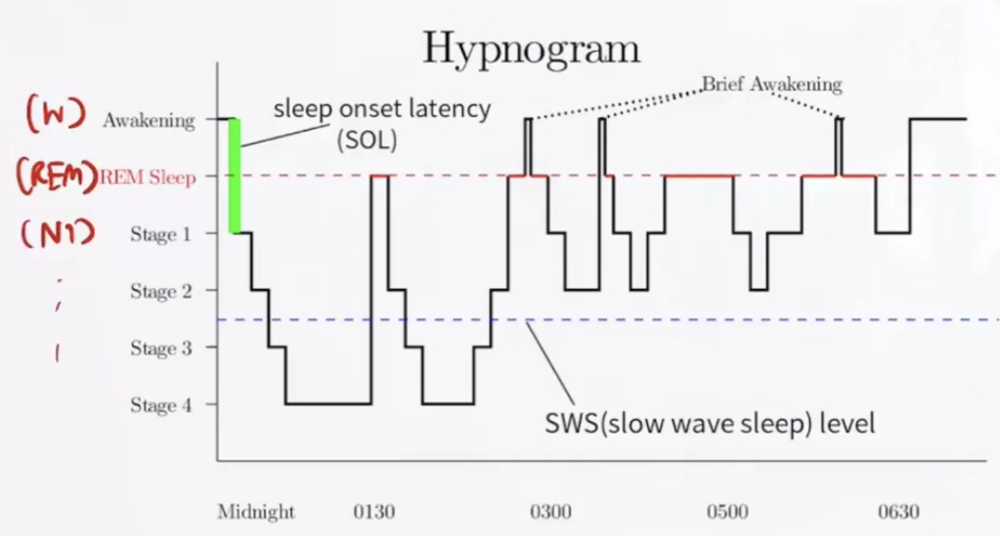
picture of comparing result
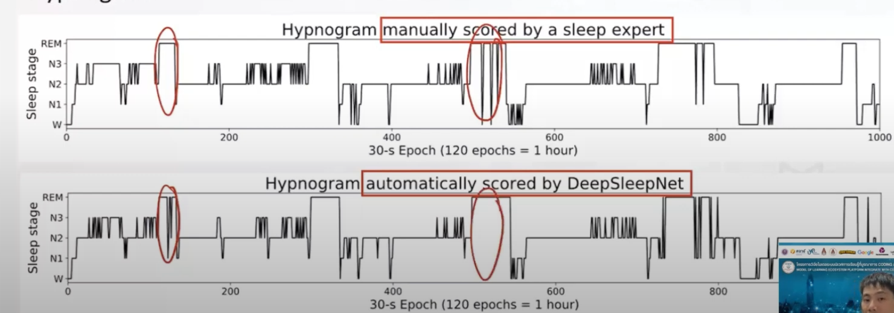
# Workshop
my work
```python
def simple_model():
    model = nn.Sequential(
        nn.Conv1d(in_channels=1, out_channels=128, kernel_size=50, stride=6, bias=False),
        nn.BatchNorm1d(num_features=128, eps=0.001, momentum=0.01),
        nn.ReLU(inplace=True),

        nn.MaxPool1d(kernel_size=8, stride=8),

        nn.Dropout(p=0.5),

        nn.Conv1d(in_channels=128, out_channels=128, kernel_size=8, stride=1, bias=False),
        nn.BatchNorm1d(num_features=128, eps=0.001, momentum=0.01),
        nn.ReLU(inplace=True),

        nn.Conv1d(in_channels=128, out_channels=128, kernel_size=8, stride=1, bias=False),
        nn.BatchNorm1d(num_features=128, eps=0.001, momentum=0.01),
        nn.ReLU(inplace=True),

        nn.Conv1d(in_channels=128, out_channels=128, kernel_size=8, stride=1, bias=False),
        nn.BatchNorm1d(num_features=128, eps=0.001, momentum=0.01),
        nn.ReLU(inplace=True),

        nn.MaxPool1d(kernel_size=4, stride=4),
        nn.Dropout(p=0.5),
        nn.Flatten(),
        nn.Linear(in_features=1280, out_features=5, bias=False),
    )
    return model
```
result of training
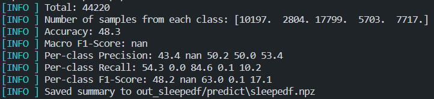
there are nan value in the output which occur by zero divide which may conclude that nan is 0 and the performance in class N1 is really bad because following reason
- we does not have sequential learning
- we does not weight the loss function for unbalance datasets
- we use very low number of iterations for training