# Introduction
So this project focus on detecting bile duct cancer in SEA people which frequently occur because they love to eat raw fish from river which found infested with parasite name Trematoda Which patient will have only 2-5 years of living after found infested.

 But early stage of this can be diagnose via ultrasound images So if we successfully screen potential patient we can reduce rate of infection. However ultrasound images require experience doctor  to analyses. But we lack of experience doctor. Which make screening not perform effectively. And that why we use deep learning model instead.

 # Model
This model named Bitnet (Bilinary track network) according to its purpose
Which this model is implemented in over 200 hospitals in thailand under cooperate with bile duct cancer research center

## Dataset
ultrasound images of upper  tummy which contain organs that involve bile duct’s process and here is the images of scanning position.
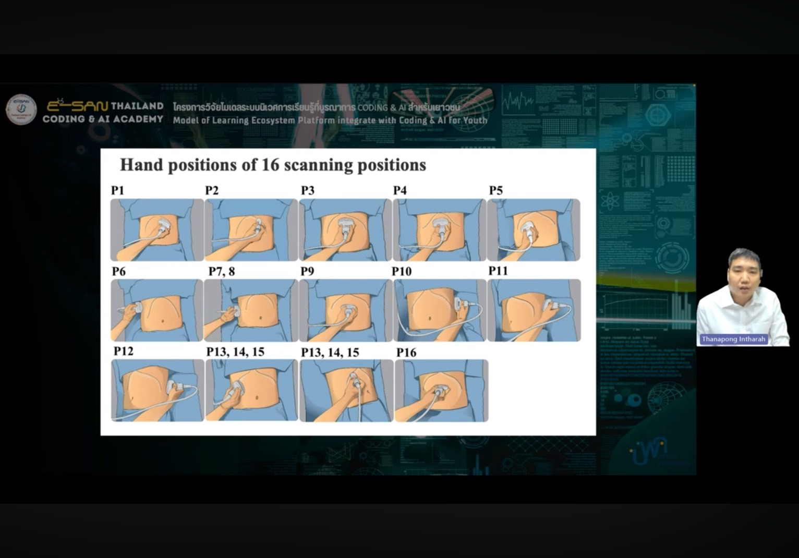

And some doctor use different type of position for their work which make this problem more challenging because this task is user dependent input
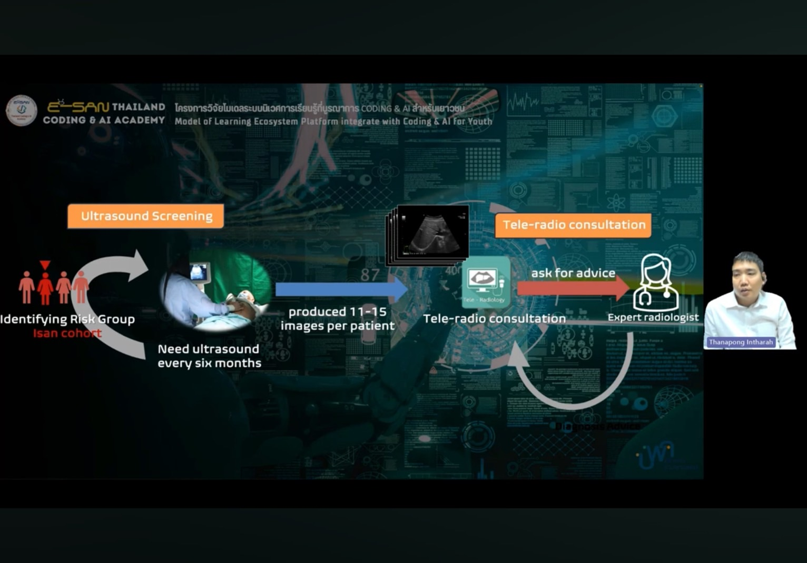
The scan is performed every 6 months and 1 patient will produce 11-15 images. In one year there are approximately 50k patients. And we found bottleneck in analysis process from the reason mention earlier.

Here is the distribution of the images we got. Each classes represent character of each behavior.
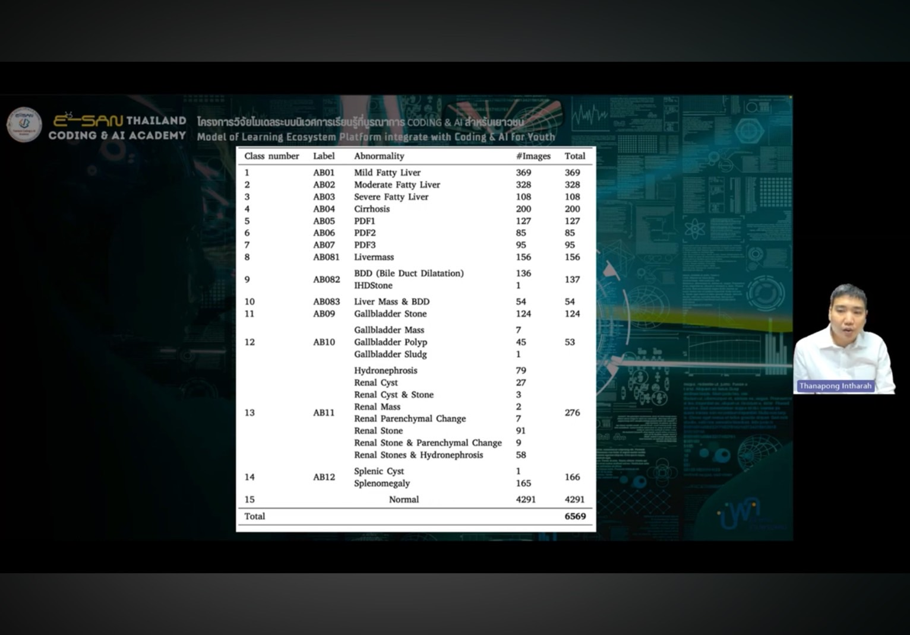
hierarchy of metadata
Classes viewing-angle .patient-case
Ex. Ab1 A1 P4-2 CaseA1.jp
|table of dataset| file hierarchy|
|--|--|
|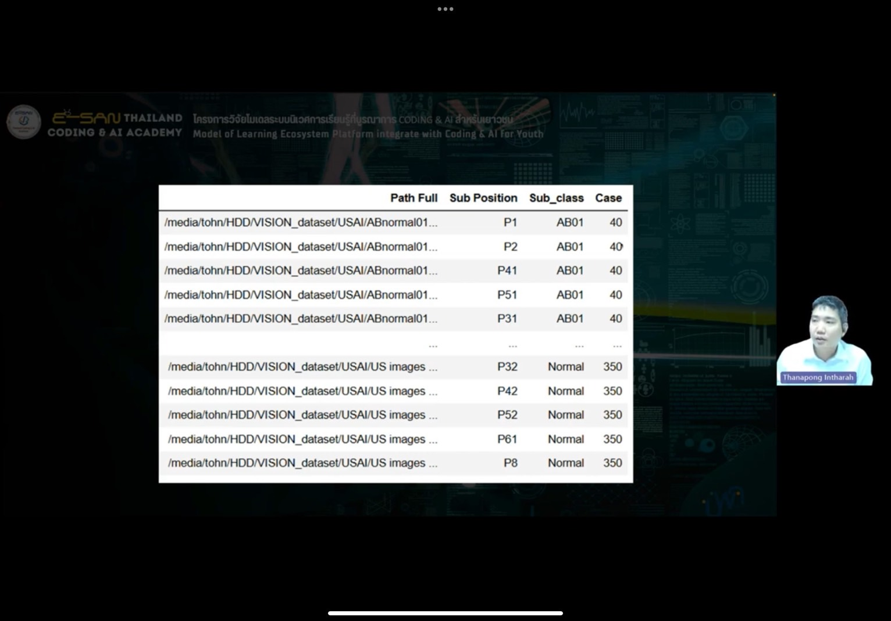|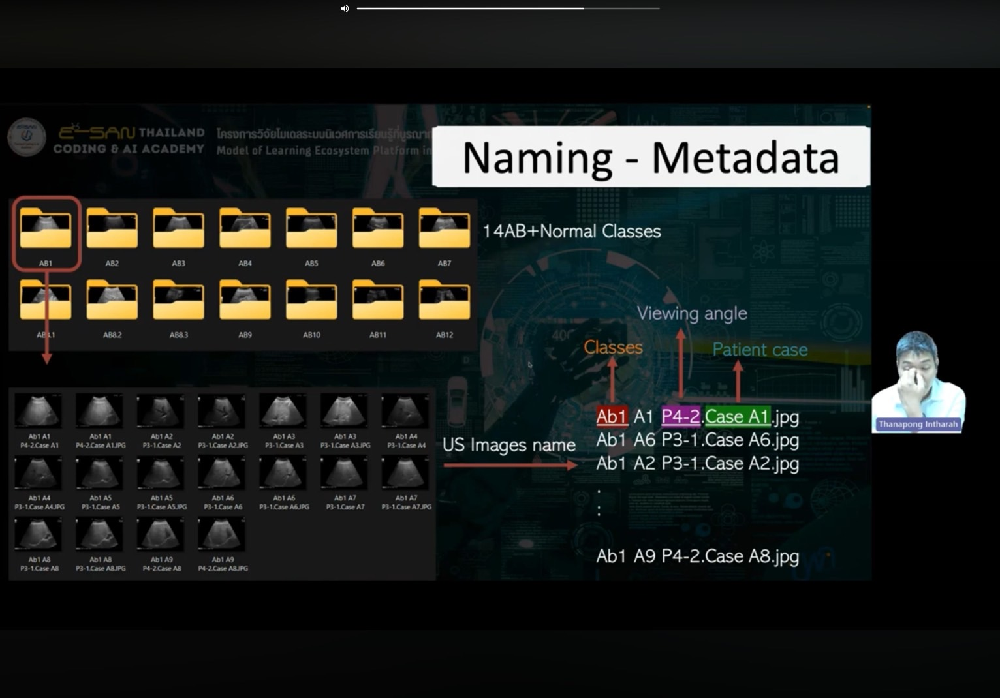|

And then we do normal k fold cross validation that we have learned in biosignal project
In this project we do 10 fold validation. Here is final ratio of the data.
|training set images| distribution of view position and behavior of bile duct.|
|-|-|
|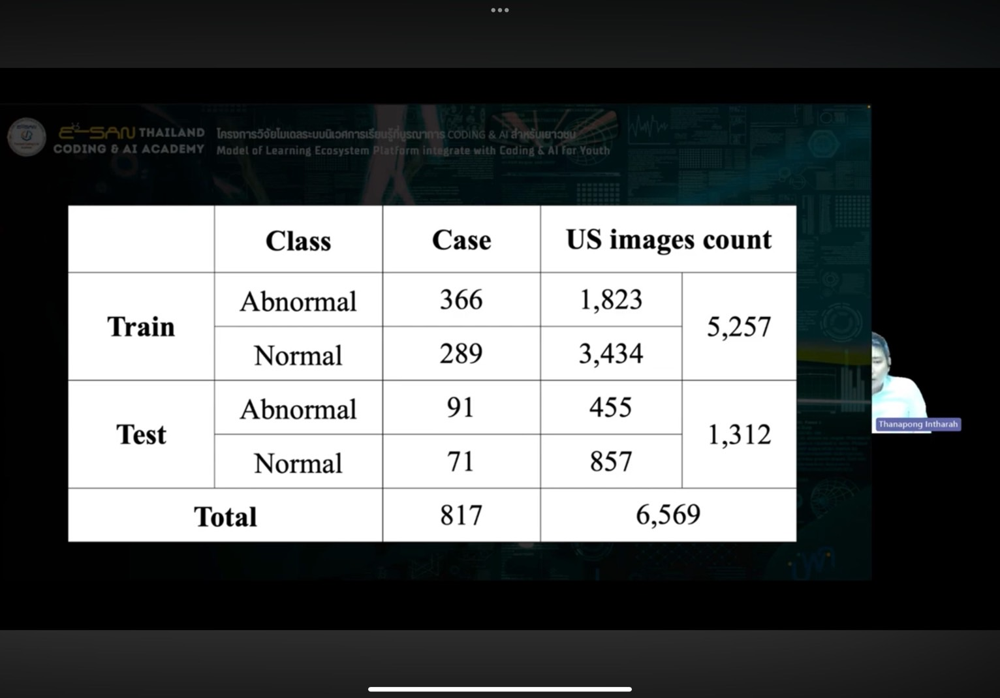|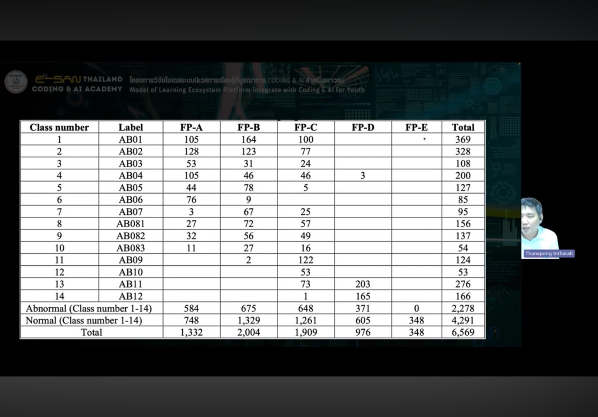|

## pre processing
For Preprocessing we do the following method 
1. Remove background noise (Texts)
2. Then we select input for our model in order to select proper augmentation
For augmentation we only do
- horizontal shift
- vertical shift
- rotational 30 degree
- zoom
- brightness
- sheer
 
For the model we use efficient net b5 with default parameter for feature extractor and then we use RF ml for classification
Which efficient net is set to be not trainable so we are using pre-train model by google now so of course the framework we will use is tensorflow.

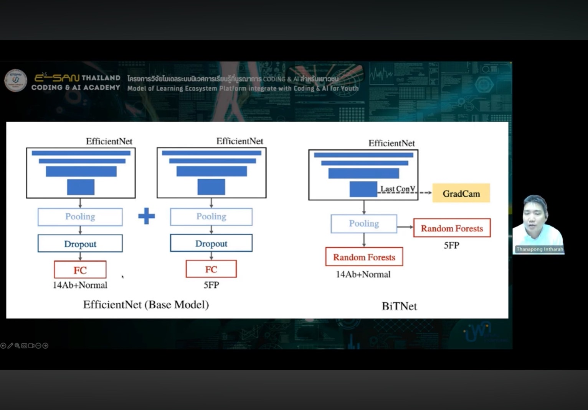

And we select this pre train model because it has big size of input images se we can retain small detail as much as possible with 456 x456 size. Also, according to benchmarking eff B5 has highest accuracy.

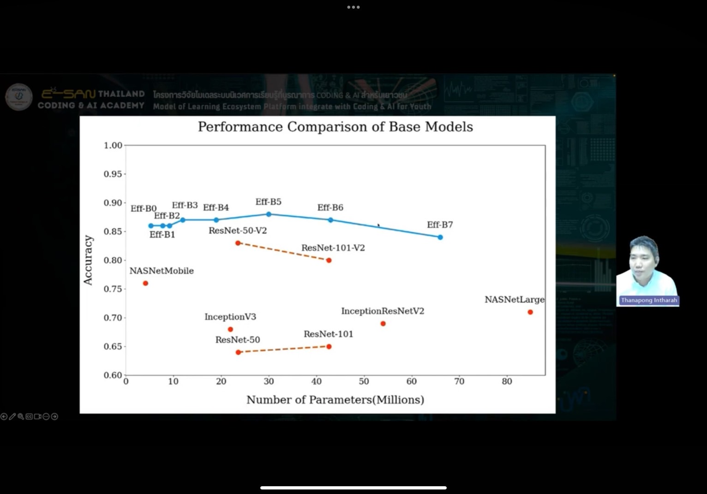

## Application 
And this model is implemented in 2 applications 
1. Pre scanning which is utilize with REST API through tele-radiology app to pre scan before sending abnormal case to expert. which normal case will be dis carded only when it has 100% confident of Normal prediction.
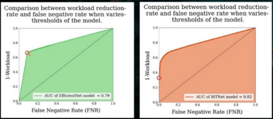

This is graph of FN rate which is abnormal case that seen as normal which needed to be very low

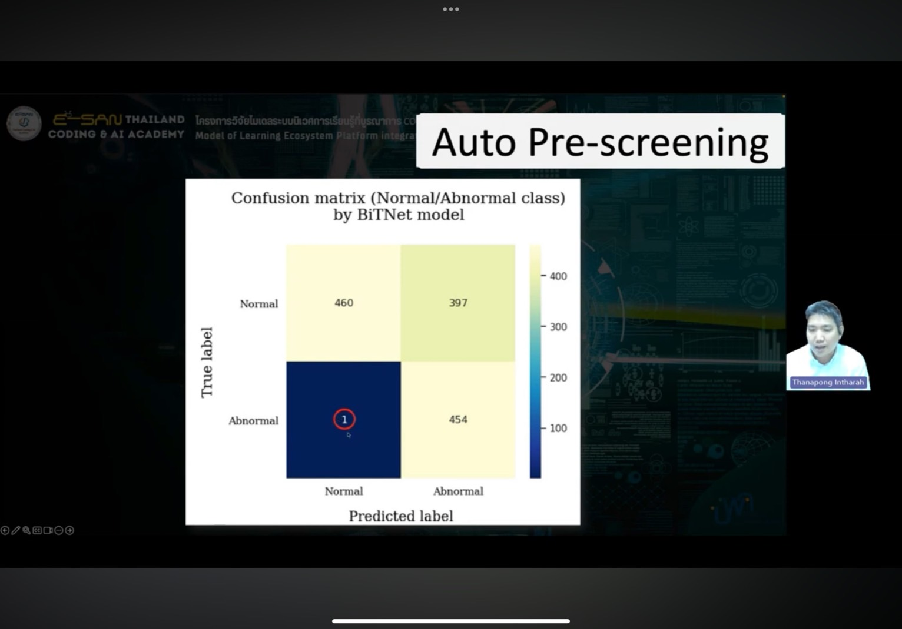

And from this confusion matrix FN is good.However there are too much FP it is almost equal to TP which is room for improvement

2. Detect and classify abnormality from uploaded images

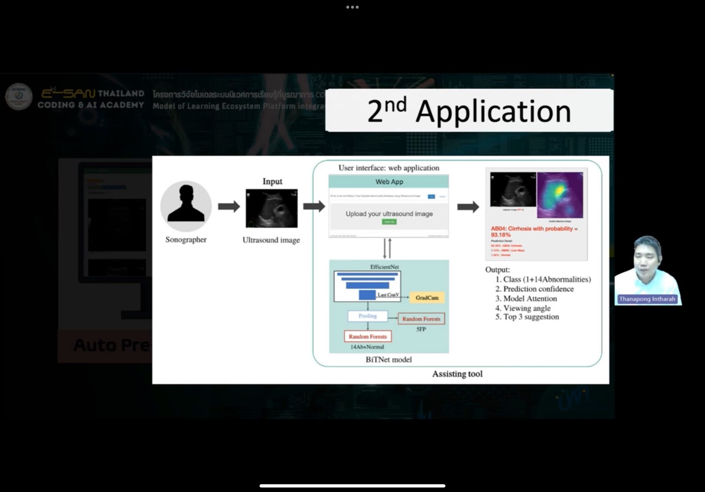

This application also provide area that model has attention to with technique of grad cam to observe gradient of each layer in model to see which part of picture (filter) has most activity which we can visualize it for further information

And these application is proved by 4 doctor
1. general practitioner
2. Resident radiologist
3. Non-Hepatobilaryradiologist
4. Hepatobilary radiologist
 by conduct experiment with 2 group of scenario that consist these 4 type of doctor
1. Predict 150 test images with AI and then wait 4 weeks then try again with no assisting
2. Predict 150 test images with no AI and then wait 4 weeks then try again with AI assisting

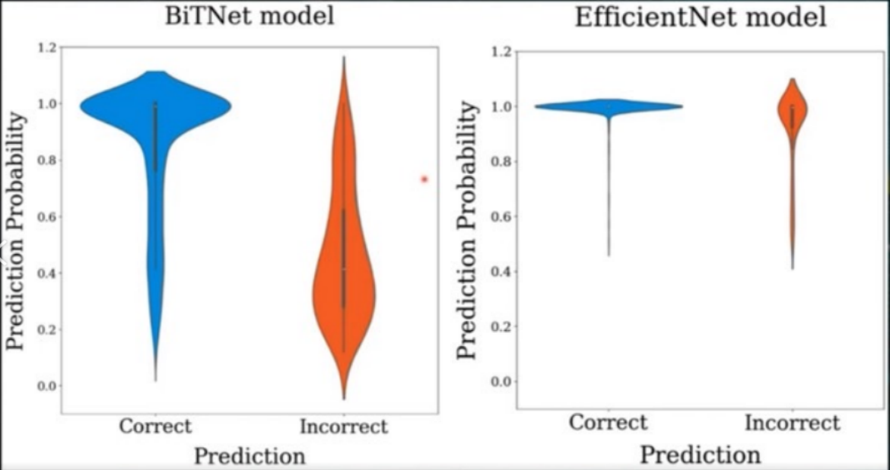

And they found that there is problem that the model predict all cases with high confident. Which model prediction affect real doctor decision. And this is because pure efficient net is overfit so they change classifier to RF which resolve this problem. the efficientnet they obtain is finetuned by the dataset.

# Result and metric
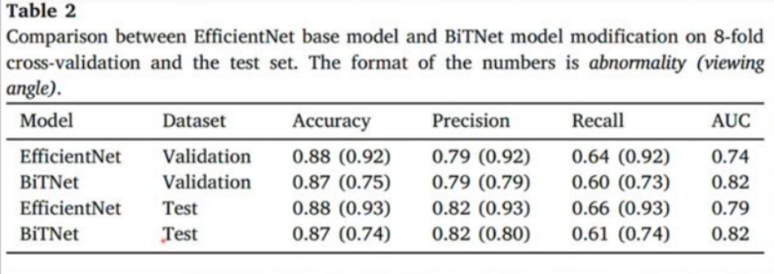
# Workshop 
for this project is dog vs cat classification
the out put for the model is the possibility of each class which all sum up to 1
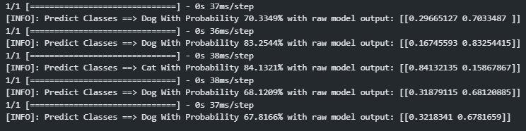
and these out put is obtained from 5 different animals
|bird|car|Tiger|Lion|Fox|
|-|-|-|-|-|
|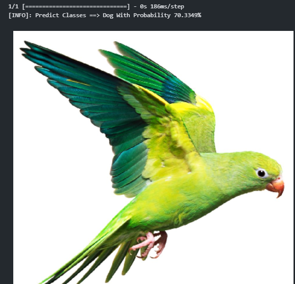|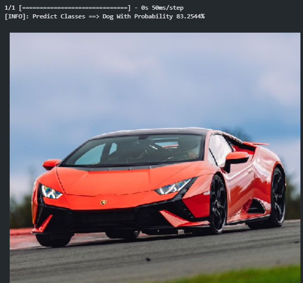|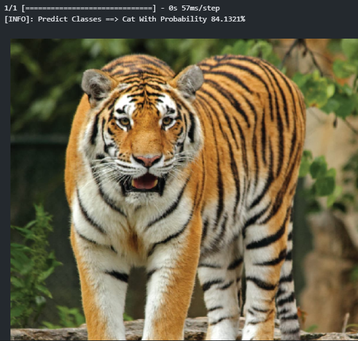|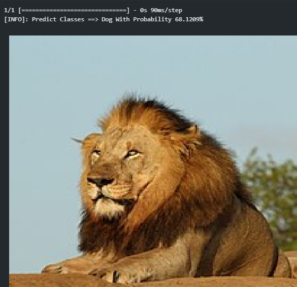|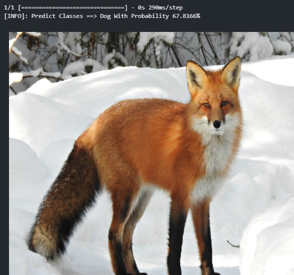|
|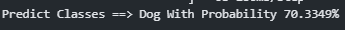|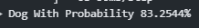|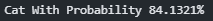|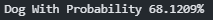|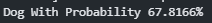|

and these outcome is influence by the gesture of each animal.