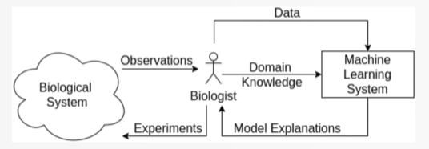
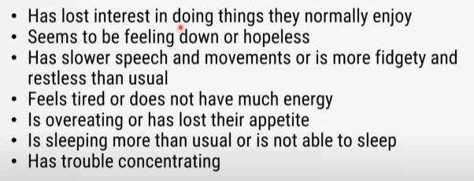
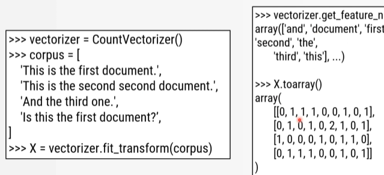
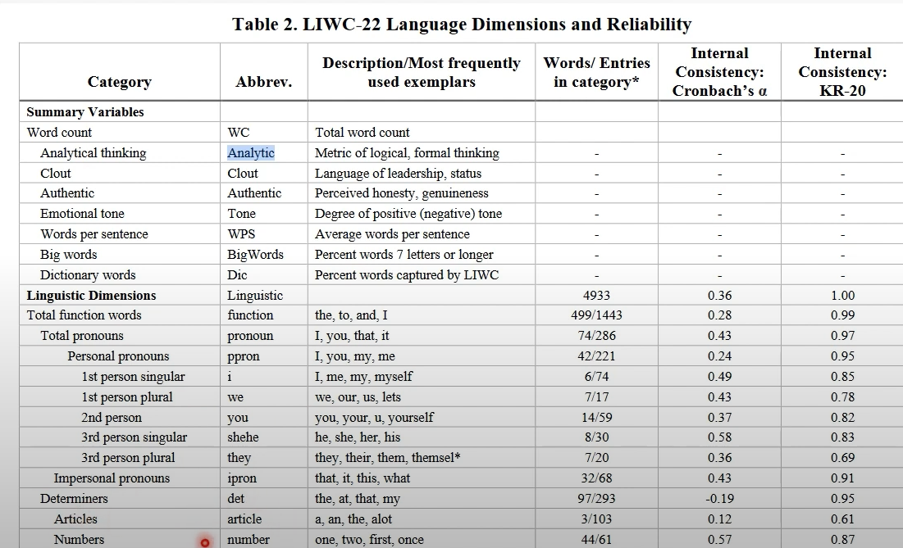
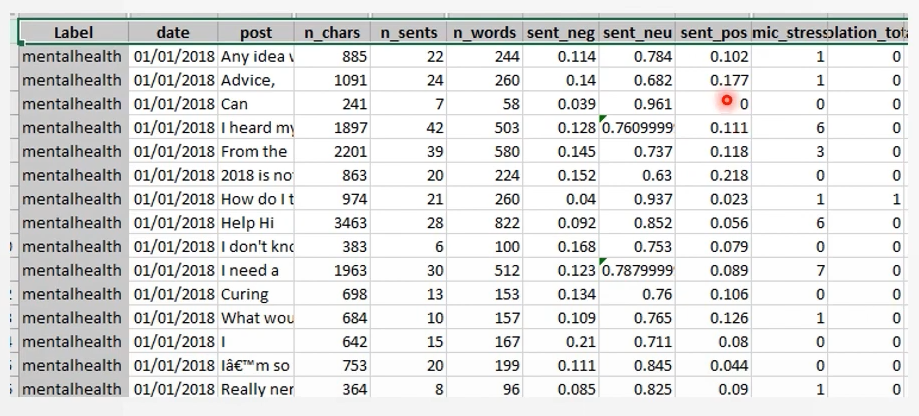
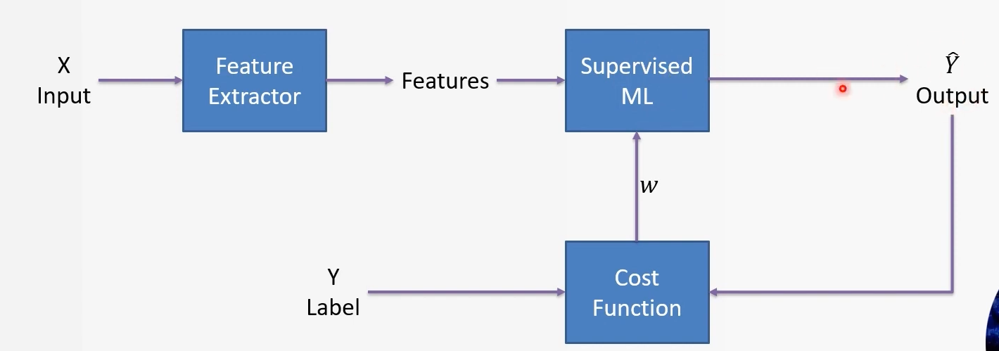
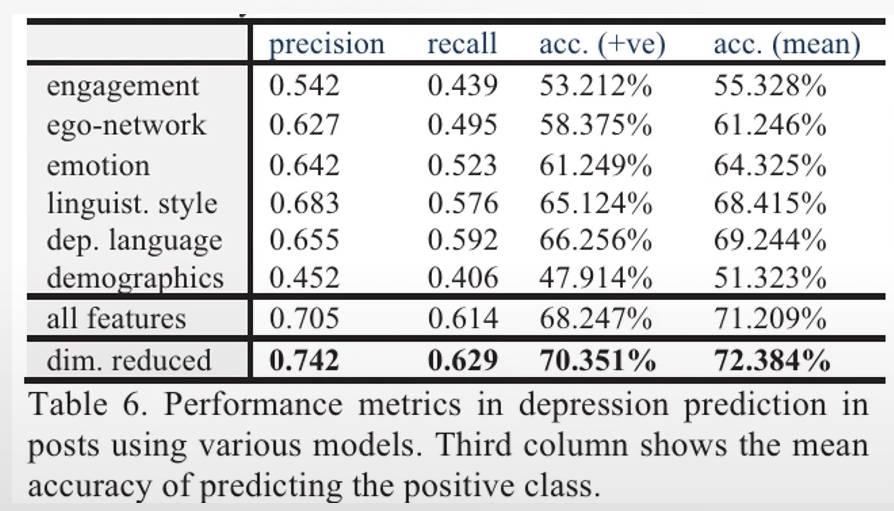
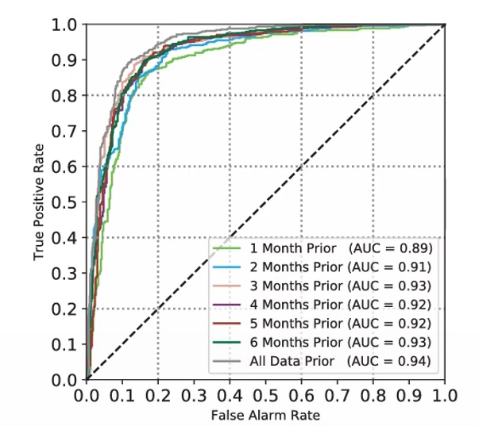

# Introduction
this project is about detecting mental disorder. the dataset is mostly come from social media because social footprint roughly represent current behavior which can be used for inference mental disorder. Further more, Social network is used by large portion of population and can be accessed immediately.
Mental disorder is one things that need to be carefully solved in order to prevent mental breakdown that may lead to crimes, murder and suicide. which would be nice if we can save them.

# Data
## Domain knowledge 

Domain knowledge is required for efficient Feature extraction 
## symptoms of depression

## Pre-processing

- Vectorization

we do this in order to find number representation  for computer and also find direction of sentiment for each word. which are perform by LIWC for feature extraction.

- Visualization
Data Exploration helps us to understand more about behavior such as trend or distribution of data which will affect performance of the model. and if we use those insight correctly we can improve our model even further.

 - Feature extraction
    - word count
    - each word sentiment

and image below is data that available to model.

# Modelling
In this project we will use classical supervise machine learning (i.e. Logistic Regression)

here is frameworks for developing this model which feature extraction we will use LIWC and use extracted features for model input 

# Evaluation

as you can see that best solution utilize feature selection technique to reduce number of feature  which reduce number of feature and in mathematical representation this may mean removing outlier features.

and from ROC result this is pretty good model that FAR is low but TPR is high and this compare result of using data in pass x times.this graph conclude that the more data given the more accurate it got.

