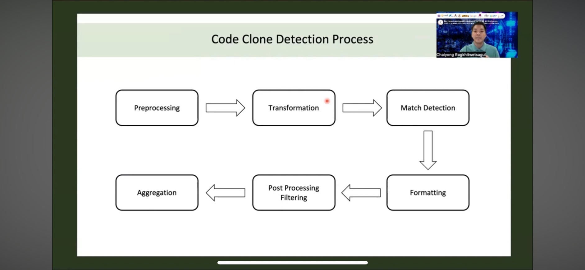

# Introduction 
In software development we have to do coding which also can be done by copying code from other people. In some case, it is "ok" to copy other people code for learning something new. But it is consider to be plagiarism if we use in commercial context and also some learner use this method to avoid doing assignment by themselve. Which makes learning outcome getting worse. Therefore it is crucial to determine if the code is plagiarize but there is tremendous about of code that you need to recheck in order to do that so we use machine learning instead. Method in this project we utilize pre-train model for feature extraction code2vec (codeBERT) Also this type of feature can be use for reducing code redundance

Cloning can be detect by look up their similarities to each other
And there is 4 level of cloning 
1. Exact match (ctrl cv)
2. Edit variable name
3. Paraphrase some statement
4. Same function different style of coding


# case study of this kind of project

In this case study 
We use data from big clone bench dataset in java language project over 25k project 
Which we extract these data first we will get label then search  source code from the same dataset

And in this project we focus only on cloning level 1-3 because type 4 is hard to detect and acceptable because it may be common knowledge such as sorting algorithm 

This is spliting data ratio for this case


## process

Preprocess by remove white space then find. Vector of code then find matching (we assume them as criteria ) then format the outcome and delete outliner and pack them and put them out

Then we do code matrix extraction to determine which factor we will use to consider cloning behavior. Which come from **style of syntax** and **algorithm** of each code 
### Syntactic matrix

 have element such as 
 - number of token
 - word count
 - number of line
 - file names
 

  which input is 2 source code that need to be compared so the matrix is obviously the differences of the factor of the input 
  ### semantic matrix
  
  in this case we find cosine similarity of the code vector from code2vec assuming from training data that same kind of coding style will have the same vcode vector
  ### example of extracted features
  
  in last step we fit these data to ML model such as ST,SVM,RF and etc.
  ## evaluation
  there is 2 context which is 
  - model accuracy or performance -> Precision and recall evaluation
  - user experience (testing by surway)
    - usability test
    - compare with other exist product.
 ## implementation
 
 we receive code from github then parse it and extract vector and token and extract feature according to coding matrix then input them to our model and it is done.
 
 # workshops
  
  
 this is heatmap plot using seaborn library using this code that I customize by myself
 ```python
A = np.array(cv1, dtype=float)
B = np.array(cv2, dtype=float)
C = np.array(cv3, dtype=float)
D = np.array(cv4, dtype=float)
cv = [A,B,C,D]
sim = np.zeros(shape = (4,4))
for i in range(4):
  for j in range(4):
    sim[i][j] = cos_sim(cv[i],cv[j])

ax = sns.heatmap(sim, xticklabels = ["cv1","cv2","cv3","cv4"], yticklabels = ["cv1","cv2","cv3","cv4"], annot=True )
ax.set(title="cosine similarity of each code vector")
```
 for cosine similarlity it can be compute easily by this code

```python
def cos_sim(A, B):
  return np.dot(A,B)/(norm(A)*norm(B))
```
we calculate them this way because now each code is vector then alignment is equivalent to similarity of the code so we can use dot product to calculate the alignment and use it as similarity.
