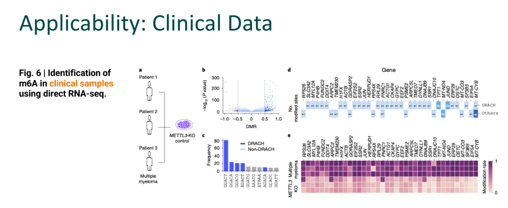

#  Domain knowledge
## Central Dogma

it is fundamental principle of genetic information flow which to simplify all cell have DNA which is pattern for generating RNA (we call transcription)  used for crating important proteins that essential for maintain body's function.

Sometime, transcription have error occur makes RNA become abnormal due to abnormal base sequencing which cause some enzyme deficiency. In the past, to detect that, we use DNA sequencing by converge the RNA back to DNA.But now, In this project we use Direct RNA sequencing by simulate protein gate receptor for receive RNA and then read directly through sensor. and this is brief mechanic of Oxford Nanopore.

## DNA Modification
other than transcription, there is RNA modification which is base editing by adding some chemical group to existing base in RNA structure.In nature, this process mostly occur in cell parts or we call organelle that function as cell's energy producer such as Mitochondria and chloroplast.

# Objective
In this project, they focus on detecting whether there is m6A modification or not. because disruption in m6A is related to cancer, immunity diseases. in order to study that they need to find modification rate of RNA which then they will find differential between RNA that have no m6a and interested RNA.

which they used Nanopore technology that can detect all possible modification types that does not require training data.

# GMM explaination
full name of this model is Gaussian Mixture modelling. In simple way this model believe that each data have its own gaussian distribution and when they mix together it may form overlapping distribution which they eliminate this by using Bayesian concept of possibility to determine possibility of inference categories
 which each distribution will get random parameter of variance and mean iteratively to fit on the data
 

They use this model for this problem because it fit to this model assumption prior to domain knowledge. and it work effectively
## workshop evaluation
|generated samples          | GMM estimate result      |
|---|---|
|   |    |

in work shop we have tries gmm created by sklearn which as you can se that it is pretty accurate

# critisism
in model analysiswe use precision and recall for further analysis of accuracy that it better in detecting which class lead to usability testing.

for model evaluation the criteria is design prior to domain knowledge which evaluate Applicability by test apply this on others and real world data

 
